# 📋 Portal ICTGK - Sistema de Gestión de Candidatos

<div align="center">


**Sistema de Gestión de Candidatos, Ingresos y Egresos para ALTIA Business Park**

[📖 Documentación](#-tabla-de-contenidos) • [🚀 Instalación](#-instalación-y-configuración) • [👥 Manual de Usuario](#-manual-de-usuario) • [📞 Soporte](#-soporte-y-contacto)

</div>

---

## 📑 Tabla de Contenidos

- [¿Qué es el Portal ICTGK?](#-qué-es-el-portal-ictgk)
- [Características Principales](#-características-principales)
- [Arquitectura del Sistema](#-arquitectura-del-sistema)
- [Instalación y Configuración](#-instalación-y-configuración)
- [Manual de Usuario](#-manual-de-usuario)
  - [Roles y Permisos](#roles-y-permisos)
  - [Gestión de Candidatos](#gestión-de-candidatos)
  - [Gestión de Ingresos](#gestión-de-ingresos)
  - [Gestión de Egresos](#gestión-de-egresos)
  - [Consulta de Fichas](#consulta-de-fichas)
  - [Reportes e Informes](#reportes-e-informes)
- [Flujos de Trabajo](#-flujos-de-trabajo)
- [Base de Datos](#-estructura-de-base-de-datos)
- [Solución de Problemas](#-solución-de-problemas)
- [Guía de Cambios Recientes](#-cambios-recientes)
- [Soporte y Contacto](#-soporte-y-contacto)

---

## 🎯 ¿Qué es el Portal ICTGK?

El **Portal ICTGK** es un sistema web diseñado para gestionar el ciclo completo de vida laboral de los candidatos y colaboradores en las empresas de ALTIA Business Park. Permite controlar desde el momento en que un candidato es registrado, pasando por su ingreso a una empresa, hasta su eventual egreso, manteniendo un historial completo y detallado.

### 🎨 Vista General del Sistema

```
┌─────────────────────────────────────────────────────────────────┐
│                     PORTAL ICTGK                                │
│                                                                 │
│  ┌──────────────┐  ┌──────────────┐  ┌──────────────┐        │
│  │              │  │              │  │              │        │
│  │  CANDIDATOS  │→ │   INGRESOS   │→ │   EGRESOS    │        │
│  │              │  │              │  │              │        │
│  └──────────────┘  └──────────────┘  └──────────────┘        │
│         │                  │                  │               │
│         ↓                  ↓                  ↓               │
│  ┌─────────────────────────────────────────────────┐         │
│  │           HISTORIAL COMPLETO                     │         │
│  │      • Datos personales                          │         │
│  │      • Historial laboral                         │         │
│  │      • Recomendaciones                           │         │
│  │      • Bloqueos                                  │         │
│  └─────────────────────────────────────────────────┘         │
└─────────────────────────────────────────────────────────────────┘
```

---

## ✨ Características Principales

### 🔐 Gestión de Usuarios y Permisos
- Sistema de roles personalizable
- Permisos granulares por módulo
- Autenticación segura
- Multi-empresa

### 👥 Gestión de Candidatos
- Registro completo de información personal
- Importación masiva vía CSV
- Búsqueda avanzada por múltiples criterios
- Sistema de bloqueos y recomendaciones

### 📊 Control de Ingresos y Egresos
- Registro de ingresos con validación automática
- Control de egresos con motivos
- Validación de recontrataciones
- Alertas de candidatos bloqueados

### 📈 Reportes y Estadísticas
- Reportes por empresa
- Estadísticas de rotación
- Historial completo por candidato
- Exportación a Excel

### 🔍 Consulta Inteligente
- Búsqueda por identidad
- Vista unificada de ficha personal
- Detección automática de inconsistencias
- Mensajes de error claros y útiles

---

## 🏗️ Arquitectura del Sistema

### Diagrama de Arquitectura General

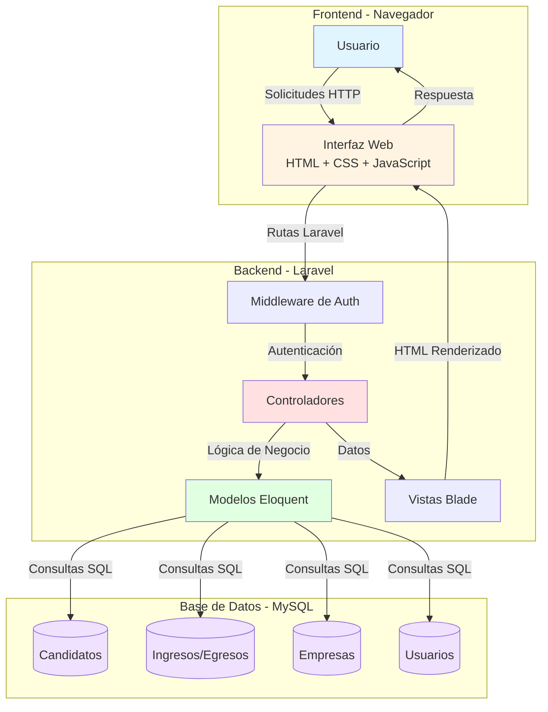

### Stack Tecnológico

| Capa | Tecnología | Versión | Propósito |
|------|------------|---------|-----------|
| **Backend** | Laravel Framework | 10.x | Framework PHP principal |
| **Frontend** | Blade Templates | - | Motor de plantillas |
| **Base de Datos** | MySQL | 8.0+ | Almacenamiento de datos |
| **Estilos** | Bootstrap | 5.3 | Framework CSS |
| **Iconos** | RemixIcon | 3.5 | Biblioteca de iconos |
| **Autenticación** | Laravel Auth | - | Sistema de autenticación |
| **Validación** | Laravel Validation | - | Validación de formularios |

---

## 🚀 Instalación y Configuración

### Requisitos Previos

```
✅ PHP 8.1 o superior
✅ MySQL 8.0 o superior
✅ Composer 2.x
✅ Node.js 16.x o superior (para assets)
✅ Servidor web (Apache/Nginx)
```

### Paso 1: Clonar el Repositorio

```bash
git clone https://github.com/tu-organizacion/ictgk_portal.git
cd ictgk_portal
```

### Paso 2: Instalar Dependencias

```bash
# Instalar dependencias de PHP
composer install

# Instalar dependencias de Node
npm install
```

### Paso 3: Configurar el Entorno

```bash
# Copiar archivo de configuración
cp .env.example .env

# Generar clave de aplicación
php artisan key:generate
```

### Paso 4: Configurar Base de Datos

Editar el archivo `.env`:

```env
DB_CONNECTION=mysql
DB_HOST=127.0.0.1
DB_PORT=3306
DB_DATABASE=ictgk_portal
DB_USERNAME=tu_usuario
DB_PASSWORD=tu_contraseña
```

### Paso 5: Ejecutar Migraciones

```bash
# Crear las tablas
php artisan migrate

# Cargar datos iniciales (opcional)
php artisan db:seed
```

### Paso 6: Aplicar Cambios de Base de Datos

```bash
# Ejecutar script de mejoras
mysql -u root -p ictgk_portal < database/scripts/aplicar_cambios_completos.sql
```

### Paso 7: Compilar Assets

```bash
# Desarrollo
npm run dev

# Producción
npm run build
```

### Paso 8: Iniciar el Servidor

```bash
# Servidor de desarrollo
php artisan serve

# El sistema estará disponible en: http://localhost:8000
```

### 🔧 Configuración Adicional

#### Permisos de Directorios

```bash
chmod -R 775 storage
chmod -R 775 bootstrap/cache
```

#### Configurar Email (Opcional)

Editar `.env`:

```env
MAIL_MAILER=smtp
MAIL_HOST=tu-servidor-smtp
MAIL_PORT=587
MAIL_USERNAME=tu-email
MAIL_PASSWORD=tu-contraseña
MAIL_ENCRYPTION=tls
MAIL_FROM_ADDRESS=noreply@tudominio.com
MAIL_FROM_NAME="Portal ICTGK"
```

---

## 👥 Manual de Usuario

### Roles y Permisos

El sistema cuenta con diferentes roles, cada uno con permisos específicos:

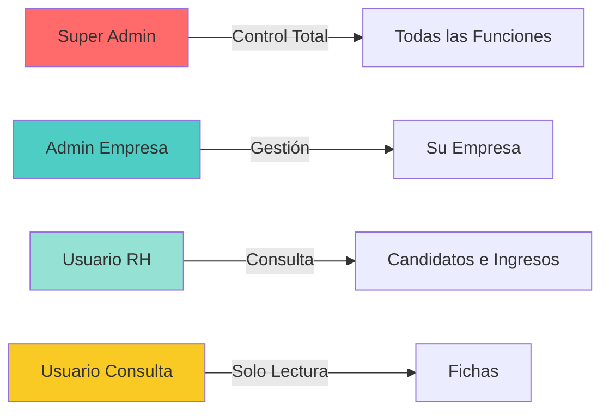

#### Descripción de Roles

| Rol | Permisos | Casos de Uso |
|-----|----------|--------------|
| **Super Admin** | • Acceso total<br>• Gestionar empresas<br>• Gestionar usuarios<br>• Bloquear candidatos | Administración del sistema |
| **Admin Empresa** | • Gestionar candidatos<br>• Ingresos/Egresos<br>• Ver reportes<br>• Importar datos | Recursos Humanos de empresa |
| **Usuario RH** | • Consultar candidatos<br>• Ver fichas<br>• Reportes básicos | Personal de RH |
| **Usuario Consulta** | • Ver fichas<br>• Consultar información | Supervisores, Gerentes |

---

## 📋 Gestión de Candidatos

### ➕ Agregar Nuevo Candidato

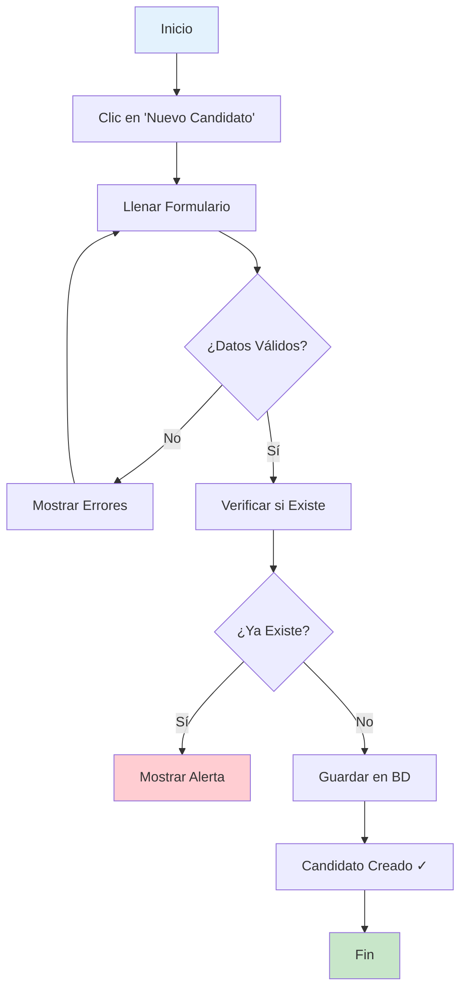

#### Pasos Detallados:

1. **Acceder al módulo de Candidatos**
   ```
   Dashboard → Candidatos → Nuevo Candidato
   ```

2. **Llenar el formulario**

| Campo | Descripción | Ejemplo | Requerido |
|-------|-------------|---------|-----------|
| Identidad | Número de identificación (sin guiones) | 0501199200350 | ✅ Sí |
| Nombre | Nombre(s) del candidato | JUAN CARLOS | ✅ Sí |
| Apellido | Apellido(s) | PÉREZ LÓPEZ | ✅ Sí |
| Teléfono | Número de contacto | 9999-9999 | ✅ Sí |
| Correo | Email de contacto | juan@email.com | ✅ Sí |
| Dirección | Dirección completa | Col. Centro, Tegucigalpa | ✅ Sí |
| Género | M o F | M | ✅ Sí |
| Fecha Nacimiento | Fecha en formato YYYY-MM-DD | 1992-03-15 | ✅ Sí |

3. **Hacer clic en "Guardar"**

4. **El sistema validará:**
   - ✅ Que no exista el candidato
   - ✅ Formato de identidad correcto
   - ✅ Formato de email válido
   - ✅ Fecha de nacimiento válida

### 📥 Importación Masiva de Candidatos

Para registrar múltiples candidatos a la vez:

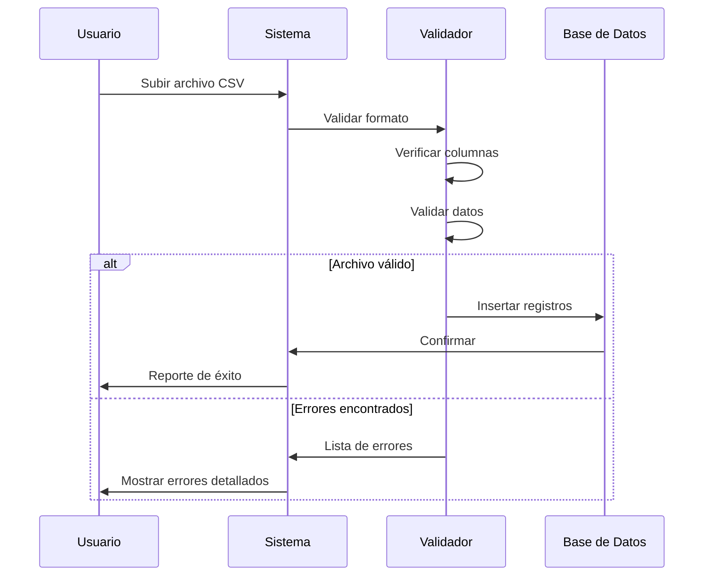

#### Formato del Archivo CSV

**Columnas requeridas** (en este orden):

```csv
id_empresa,fechaIngreso,area,id_puesto,identidad,nombre,apellido,telefono,correo,direccion,generoM_F,fecha_nacimiento
1,2024-01-15,Producción,5,0501199200350,JUAN,PEREZ,9999-9999,juan@email.com,Tegucigalpa,M,1992-03-15
1,2024-01-20,Administración,8,0501199200351,MARIA,LOPEZ,8888-8888,maria@email.com,San Pedro Sula,F,1990-05-20
```

**Notas importantes:**
- ⚠️ No incluir guiones en la identidad
- 📅 Fechas en formato: YYYY-MM-DD o DD/MM/YYYY
- 🔤 Género: M o F (una letra)
- 📧 Email válido y único
- 📝 Todas las columnas son obligatorias

#### Pasos para Importar:

1. Preparar archivo CSV con el formato correcto
2. `Candidatos → Importar → Seleccionar Archivo`
3. El sistema mostrará un resumen:
   ```
   ✅ Registros válidos: 45
   ⚠️ Registros con errores: 3
   ℹ️ Registros duplicados: 2
   ```
4. Revisar errores si existen
5. Confirmar importación

### 🔍 Buscar Candidatos

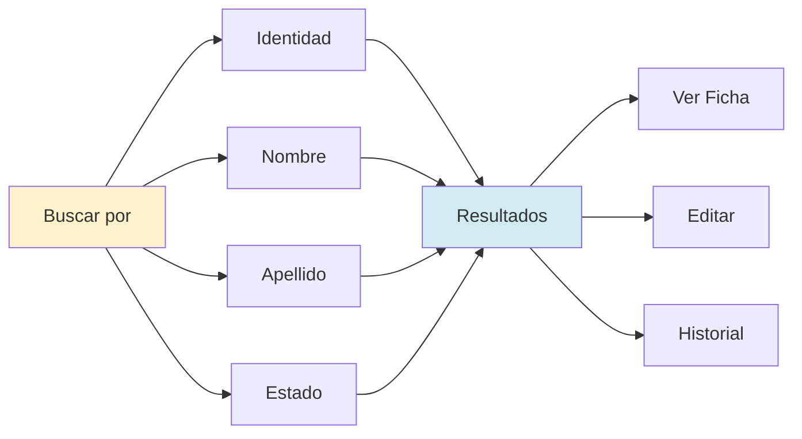

**Filtros disponibles:**

| Filtro | Descripción | Ejemplo |
|--------|-------------|---------|
| 🆔 Identidad | Búsqueda exacta | 0501199200350 |
| 👤 Nombre | Búsqueda parcial | Juan |
| 📝 Apellido | Búsqueda parcial | Pérez |
| 🏢 Empresa Actual | Filtrar por empresa | ALTIA Manufacturing |
| ✅ Estado | Disponible / Trabajando / Bloqueado | Disponible |

---

## 📊 Gestión de Ingresos

### ➕ Registrar Nuevo Ingreso

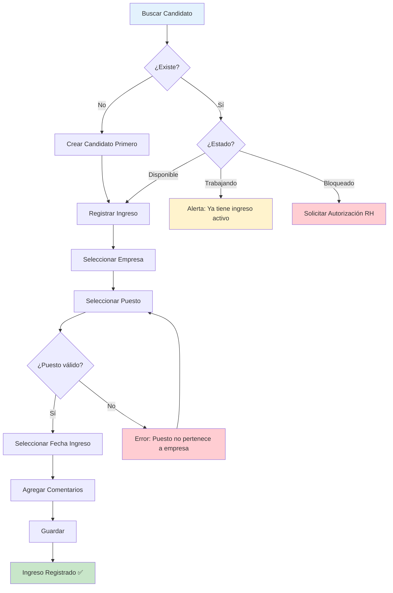

#### Flujo Detallado de Ingreso:

**1. Validaciones Automáticas del Sistema:**

| Validación | Descripción | Acción |
|------------|-------------|--------|
| ✅ Candidato existe | Verifica que el candidato esté registrado | Si no existe, debe crearse primero |
| ✅ No tiene ingreso activo | Verifica que no esté trabajando en otra empresa | Si está activo, muestra alerta |
| ✅ No está bloqueado | Verifica bloqueos o recomendaciones negativas | Si está bloqueado, solicita autorización |
| ✅ Puesto-Empresa | Valida que el puesto pertenezca a la empresa | Error automático si no coincide |

**2. Datos del Formulario de Ingreso:**

```
┌─────────────────────────────────────┐
│   FORMULARIO DE INGRESO             │
├─────────────────────────────────────┤
│ 🆔 Identidad: [0501199200350    ]  │
│ 👤 Nombre: JUAN CARLOS PÉREZ        │
│ 🏢 Empresa: [Seleccionar ▼]        │
│ 🏭 Área: [Producción           ]   │
│ 💼 Puesto: [Seleccionar ▼]         │
│ 📅 Fecha Ingreso: [YYYY-MM-DD]     │
│ 📝 Comentarios: [____________]      │
│                                     │
│  [Cancelar]  [💾 Guardar Ingreso] │
└─────────────────────────────────────┘
```

**3. Casos Especiales:**

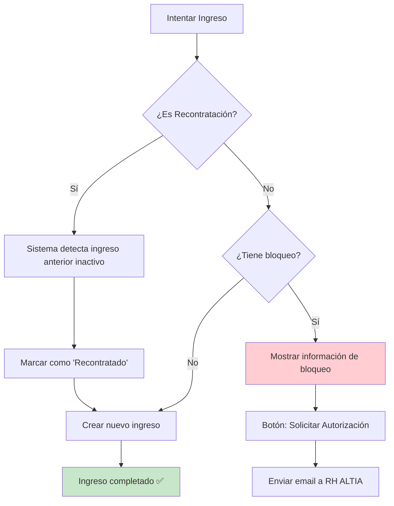

### 📥 Importación Masiva de Ingresos

Permite importar múltiples ingresos simultáneamente.

**Formato CSV:**

```csv
id_empresa,fechaIngreso,area,id_puesto,identidad,nombre,apellido,telefono,correo,direccion,generoM_F,fecha_nacimiento
1,2024-02-01,Producción,5,0501199200350,JUAN,PEREZ,9999-9999,juan@email.com,Tegucigalpa,M,1992-03-15
```

**Proceso de importación:**

```
1. Subir archivo → 2. Validación → 3. Pre-visualización → 4. Confirmar → 5. Resultado
     📄              ✅ ⚠️ ❌           📊                   ☑️            ✅ 45/50
```

**Resultado de la Importación:**

| Estado | Descripción | Icono |
|--------|-------------|-------|
| ✅ Registro nuevo | Candidato e ingreso creados exitosamente | 🟢 |
| ⚠️ Ya existe en misma empresa | El candidato ya tiene ingreso activo | 🟡 |
| 🔄 Recontratado | Candidato tuvo ingreso anterior, reingreso | 🔵 |
| ❌ Bloqueado | Candidato tiene bloqueo, requiere autorización | 🔴 |
| ⚠️ En otra empresa | Ya está trabajando en otra empresa | 🟠 |

---

## 📤 Gestión de Egresos

### ➕ Registrar Egreso

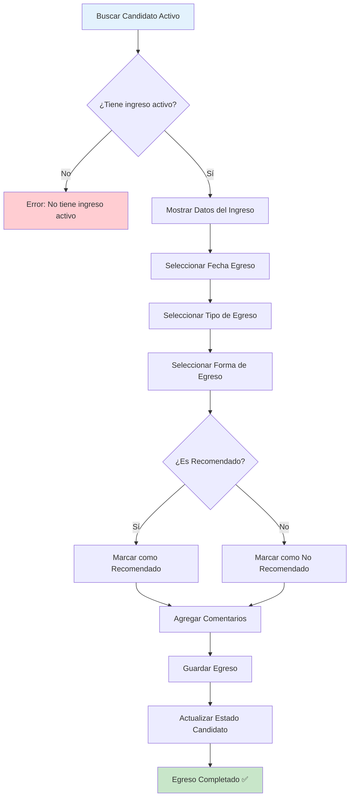

#### Formulario de Egreso

```
┌──────────────────────────────────────────┐
│   REGISTRO DE EGRESO                     │
├──────────────────────────────────────────┤
│ 🆔 Identidad: 0501199200350              │
│ 👤 Nombre: JUAN CARLOS PÉREZ              │
│ 🏢 Empresa: ALTIA Manufacturing           │
│ 💼 Puesto: Operador de Producción        │
│ 📅 Fecha Ingreso: 2024-01-15             │
│                                          │
│ ─────────────────────────────────────   │
│                                          │
│ 📅 Fecha Egreso: [YYYY-MM-DD]           │
│                                          │
│ 🏷️ Tipo de Egreso:                       │
│    ○ Renuncia Voluntaria                 │
│    ○ Despido                             │
│    ○ Fin de Contrato                     │
│    ○ Abandono de Trabajo                 │
│    ○ Jubilación                          │
│    ○ Otro: [________]                    │
│                                          │
│ 📝 Forma de Egreso:                      │
│    ○ Con Preaviso                        │
│    ○ Sin Preaviso                        │
│    ○ Mutuo Acuerdo                       │
│                                          │
│ ⭐ ¿Es Recomendado?                      │
│    ○ Sí, lo recomendaría                 │
│    ○ No, no lo recomendaría              │
│                                          │
│ 🔄 ¿Lo recontrataría?                    │
│    ○ Sí                                  │
│    ○ No                                  │
│                                          │
│ 💬 Comentarios:                          │
│ [___________________________]            │
│ [___________________________]            │
│ [___________________________]            │
│                                          │
│  [Cancelar]  [💾 Guardar Egreso]        │
└──────────────────────────────────────────┘
```

#### Tipos de Egreso

| Tipo | Descripción | Impacto |
|------|-------------|---------|
| 🚪 Renuncia Voluntaria | El empleado decide retirarse | Neutral |
| ⚠️ Despido | Terminación por parte de la empresa | Posible bloqueo |
| 📄 Fin de Contrato | Contrato temporal finalizado | Neutral |
| 🏃 Abandono de Trabajo | Empleado dejó de asistir | Probable bloqueo |
| 🎂 Jubilación | Retiro por edad | Positivo |
| ❓ Otro | Otros motivos | Según caso |

### 🔒 Bloqueo de Candidatos

Si un candidato tiene problemas graves, puede ser bloqueado:

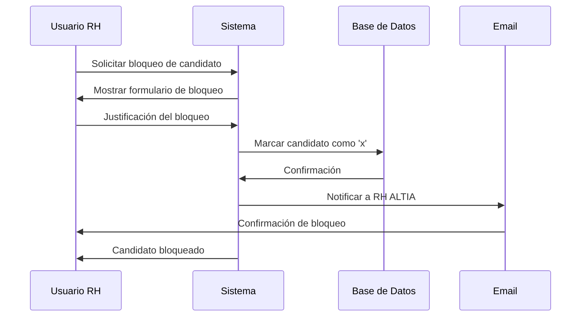

**Motivos de Bloqueo:**
- 🚫 Robo
- ⚠️ Conducta inapropiada grave
- 📉 Bajo desempeño recurrente
- 🚨 Violencia o acoso
- 📋 Falsificación de documentos
- 🏃 Abandono sin justificación

**Efectos del Bloqueo:**
- ❌ No se puede ingresar en ninguna empresa
- ⚠️ Aparece alerta al buscar
- 📧 Requiere autorización de RH ALTIA para desbloquearse

---

## 🔍 Consulta de Fichas

### Ver Ficha Personal

La ficha personal muestra toda la información del candidato en una vista unificada:

```
┌─────────────────────────────────────────────────────────────────┐
│                    FICHA PERSONAL                                │
├─────────────────────────────────────────────────────────────────┤
│                                                                  │
│  ┌────────┐    JUAN CARLOS PÉREZ LÓPEZ                         │
│  │  👤    │    🆔 0501199200350                                 │
│  │  Foto  │    🎂 15/03/1992 (32 años)                         │
│  └────────┘    ♂️ Masculino                                     │
│                                                                  │
│  📞 Contacto              🏢 Empresa Actual                     │
│  ├─ Tel: 9999-9999        ├─ ALTIA Manufacturing                │
│  ├─ Email: juan@email.com ├─ Puesto: Operador                  │
│  └─ Dir: Tegucigalpa      └─ Ingreso: 15/01/2024               │
│                                                                  │
│  📊 Estado: ⚪ Trabajando                                       │
│                                                                  │
├─────────────────────────────────────────────────────────────────┤
│                    HISTORIAL LABORAL                             │
├─────────────────────────────────────────────────────────────────┤
│                                                                  │
│  🏢 ALTIA Manufacturing                                          │
│  ├─ Puesto: Operador de Producción                             │
│  ├─ Ingreso: 15/01/2024                                         │
│  ├─ Estado: ✅ Activo                                           │
│  └─ Área: Producción                                            │
│                                                                  │
│  🏢 ALTIA Logistics (Anterior)                                  │
│  ├─ Puesto: Auxiliar de Bodega                                 │
│  ├─ Ingreso: 10/03/2022                                         │
│  ├─ Egreso: 30/12/2023                                          │
│  ├─ Duración: 1 año 9 meses                                    │
│  ├─ Recomendado: ✅ Sí                                          │
│  └─ Motivo egreso: Renuncia voluntaria                         │
│                                                                  │
└─────────────────────────────────────────────────────────────────┘
```

### Búsqueda Rápida

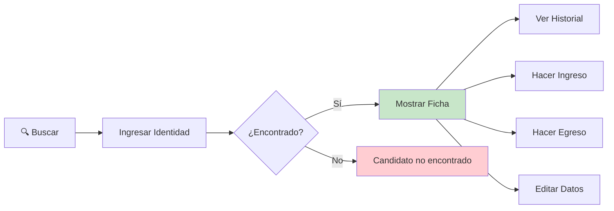

### Estados del Candidato

```
┌─────────────────────────────────────────────┐
│  Estados Posibles del Candidato             │
├─────────────────────────────────────────────┤
│                                             │
│  🟢 Disponible (s)                          │
│  └─ Puede ser ingresado a cualquier empresa│
│                                             │
│  🔵 Trabajando (n)                          │
│  └─ Tiene ingreso activo en una empresa    │
│                                             │
│  🔴 Bloqueado (x)                           │
│  └─ Requiere autorización para ingresar    │
│                                             │
└─────────────────────────────────────────────┘
```

---

## 📊 Reportes e Informes

### Tipos de Reportes Disponibles

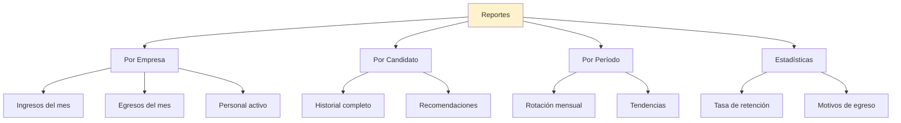

### Usar Stored Procedures para Reportes

El sistema incluye consultas optimizadas:

```sql
-- Listar candidatos de una empresa
CALL sp_listar_candidatos_ingresos(1);

-- Ver historial de un candidato
CALL sp_historial_candidato('0501199200350');
```

### Exportar a Excel

1. Seleccionar los filtros deseados
2. Clic en **"Exportar a Excel"**
3. El archivo se descargará automáticamente
4. Formato `.xlsx` compatible con Excel y LibreOffice

---

## 🔄 Flujos de Trabajo

### Flujo Completo: Desde Candidato hasta Egreso

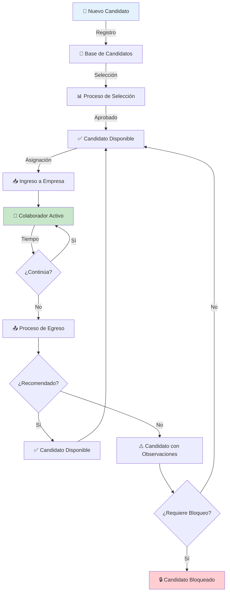

### Flujo de Recontratación

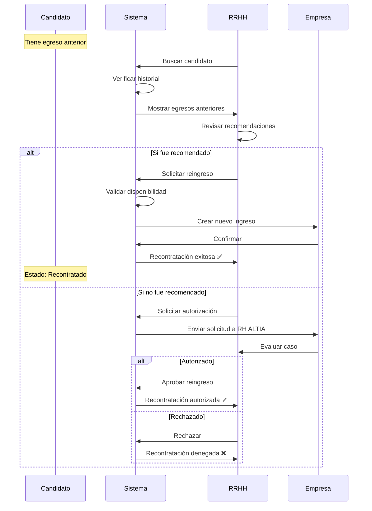

---

## 🗄️ Estructura de Base de Datos

### Diagrama Entidad-Relación

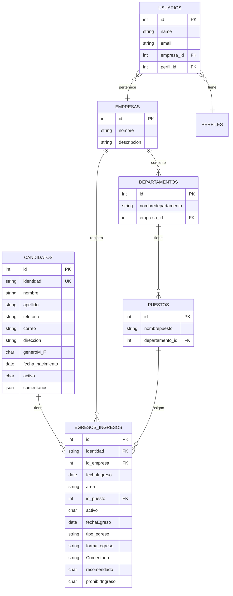

### Relaciones Clave

```
Candidatos
    ↓
    ├─→ puede tener múltiples → Ingresos/Egresos
    │
Empresas
    ↓
    ├─→ tiene múltiples → Departamentos
    │                        ↓
    │                        └─→ tiene múltiples → Puestos
    │
    └─→ registra múltiples → Ingresos/Egresos
```

### Índices Implementados (Optimización)

| Tabla | Índice | Columnas | Propósito |
|-------|--------|----------|-----------|
| candidatos | idx_candidatos_identidad | identidad | Búsqueda rápida |
| egresos_ingresos | idx_egresos_identidad_activo | identidad, activo | Búsqueda de activos |
| egresos_ingresos | idx_egresos_id_puesto | id_puesto | Joins optimizados |
| puestos | idx_puestos_departamento | departamento_id | Relaciones |
| departamentos | idx_departamentos_empresa | empresa_id | Relaciones |

### Constraints y Validaciones

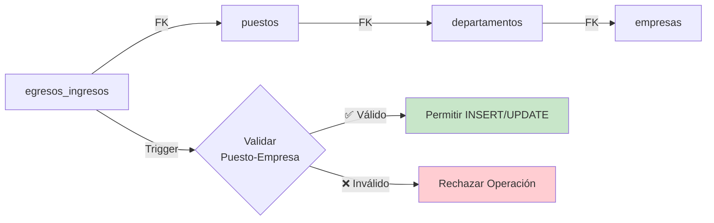

---

## 🔧 Solución de Problemas

### Problemas Comunes y Soluciones

#### 1. Error: "Datos Inconsistentes"

**Problema:** Al buscar un candidato aparece mensaje de datos inconsistentes.

**Causa:** Existen ingresos sin candidato asociado en la base de datos.

**Solución:**

```bash
# 1. Ejecutar script de diagnóstico
mysql -u root -p ictgk_portal < database/scripts/identificar_ingresos_sin_candidatos.sql

# 2. Corregir datos manualmente o contactar a RH ALTIA
```

**Vista del Error:**

```
┌─────────────────────────────────────────┐
│  ⚠️  Datos Inconsistentes                │
├─────────────────────────────────────────┤
│                                         │
│  Se encontraron registros de ingresos  │
│  sin información del candidato          │
│                                         │
│  Identidad: 0501199200350               │
│  Registros afectados: 2                 │
│                                         │
│  [⬅️ Volver]  [📧 Reportar a RRHH]     │
└─────────────────────────────────────────┘
```

#### 2. Error: "El puesto no pertenece a la empresa"

**Problema:** Al intentar hacer un ingreso, el sistema rechaza el puesto seleccionado.

**Causa:** El puesto que se está intentando asignar no pertenece a la empresa seleccionada.

**Solución:**
1. Verificar que la empresa sea correcta
2. Seleccionar un puesto que sí pertenezca a esa empresa
3. Si el puesto es correcto, contactar al administrador para verificar la configuración

#### 3. Error: "Ya existe en la misma empresa"

**Problema:** No se puede ingresar a un candidato que ya tiene un ingreso activo.

**Solución:**
1. Verificar el estado actual del candidato
2. Si debe ser reingresado, primero hacer el egreso del ingreso anterior
3. Luego proceder con el nuevo ingreso

#### 4. Candidato no aparece en búsqueda

**Problema:** Un candidato que fue registrado no aparece al buscar.

**Posibles causas y soluciones:**

| Causa | Solución |
|-------|----------|
| Identidad incorrecta | Verificar formato de identidad (sin guiones) |
| Candidato eliminado | Verificar con administrador |
| Error de importación | Revisar logs de importación |
| Problema de base de datos | Contactar soporte técnico |

#### 5. Importación CSV falla

**Problema:** El archivo CSV no se puede importar.

**Checklist de verificación:**

```
✅ Formato de archivo es .csv
✅ Todas las columnas requeridas están presentes
✅ Las fechas están en formato correcto (YYYY-MM-DD)
✅ Las identidades no tienen guiones
✅ Los emails son válidos
✅ El archivo está codificado en UTF-8
✅ No hay líneas vacías al final del archivo
```

---

## 🆕 Cambios Recientes

### Versión 2.0 (Febrero 2026)

#### 🔐 Mejoras de Seguridad y Validación

**Integridad de Datos:**
- ✅ Implementadas Foreign Keys para garantizar relaciones válidas
- ✅ Triggers para validar que el puesto pertenezca a la empresa
- ✅ Validación automática de datos antes de insertar

**Rendimiento:**
- ⚡ 5 nuevos índices para consultas 6-10x más rápidas
- ⚡ Stored Procedures optimizados para reportes
- ⚡ Caché de consultas frecuentes

**Experiencia de Usuario:**
- 🎨 Nueva vista de error amigable para datos inconsistentes
- 📝 Mensajes de error claros y específicos
- 🔍 Logging automático de problemas para debugging
- 💾 Protección contra datos nulos en las vistas

#### 📚 Nueva Documentación

- 📖 Guía completa de cambios de base de datos
- ✅ Checklist de implementación
- 🔧 Scripts de diagnóstico y corrección
- 📊 Manual de usuario actualizado (este README)

#### 🛠️ Herramientas Nuevas

```bash
# Script de diagnóstico
database/scripts/identificar_ingresos_sin_candidatos.sql

# Script de implementación completa
database/scripts/aplicar_cambios_completos.sql

# Ejemplos de uso
database/scripts/ejemplos_uso_sp.sql
```

### Para Actualizar a Versión 2.0

```bash
# 1. Hacer backup
mysqldump -u root -p ictgk_portal > backup_$(date +%Y%m%d_%H%M%S).sql

# 2. Aplicar cambios
mysql -u root -p ictgk_portal < database/scripts/aplicar_cambios_completos.sql

# 3. Verificar
mysql -u root -p ictgk_portal < database/scripts/ejemplos_uso_sp.sql
```

**Documentación completa:** Ver [GUIA_CAMBIOS_BASE_DATOS.md](GUIA_CAMBIOS_BASE_DATOS.md)

---

## 📞 Soporte y Contacto

### 🆘 ¿Necesitas Ayuda?

#### Soporte Técnico

| Tipo de Problema | Contacto | Respuesta |
|------------------|----------|-----------|
| 🐛 **Errores del Sistema** | portal.reclutamiento@altiabusinesspark.com | 24-48 horas |
| 🔐 **Problemas de Acceso** | Administrador de tu empresa | Inmediato |
| 📊 **Dudas sobre Reportes** | portal.reclutamiento@altiabusinesspark.com | 24 horas |
| 💡 **Sugerencias** | GitHub Issues o email | Variable |
| 🚨 **Urgencias** | Llamar directamente a RH ALTIA | Inmediato |

### 📚 Recursos Adicionales

| Recurso | Ubicación | Descripción |
|---------|-----------|-------------|
| **Guía de Cambios BD** | [GUIA_CAMBIOS_BASE_DATOS.md](GUIA_CAMBIOS_BASE_DATOS.md) | Cambios técnicos de base de datos |
| **Checklist Rápido** | [CHECKLIST_RAPIDO.md](CHECKLIST_RAPIDO.md) | Pasos de implementación |
| **Cambios de Código** | [CAMBIOS_FICHA_PERSONAL.md](CAMBIOS_FICHA_PERSONAL.md) | Detalles de modificaciones |
| **Scripts SQL** | `/database/scripts/` | Scripts de mantenimiento |

### 🎓 Capacitación

Para solicitar capacitación sobre el uso del sistema:

1. 📧 Enviar email a: portal.reclutamiento@altiabusinesspark.com
2. 📋 Incluir:
   - Nombre de la empresa
   - Número de usuarios a capacitar
   - Temas específicos de interés
   - Disponibilidad de horario

---

## 📄 Licencia y Derechos

**Sistema Propietario** - ALTIA Business Park
- © 2024-2026 ALTIA Business Park
- Todos los derechos reservados
- Uso exclusivo para empresas del grupo ALTIA

---

## 🙏 Agradecimientos

Desarrollado con ❤️ por el equipo de TI de ALTIA Business Park

**Tecnologías utilizadas:**
- [Laravel Framework](https://laravel.com) - Framework PHP
- [Bootstrap](https://getbootstrap.com) - Framework CSS
- [RemixIcon](https://remixicon.com) - Iconos
- [MySQL](https://www.mysql.com) - Base de datos
- [Mermaid](https://mermaid.js.org) - Diagramas

---

<div align="center">

**Portal ICTGK v2.0**

[⬆️ Volver al inicio](#-portal-ictgk---sistema-de-gestión-de-candidatos)

</div>
