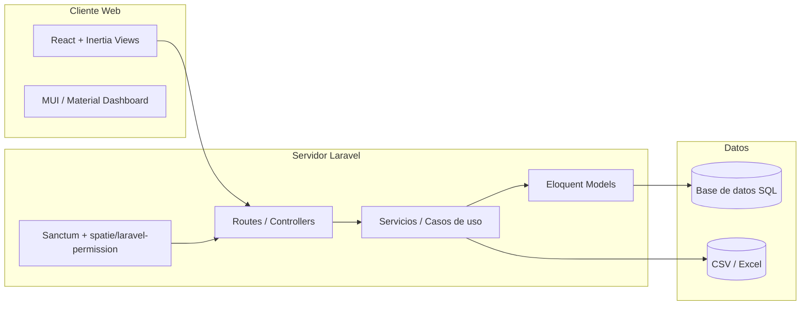
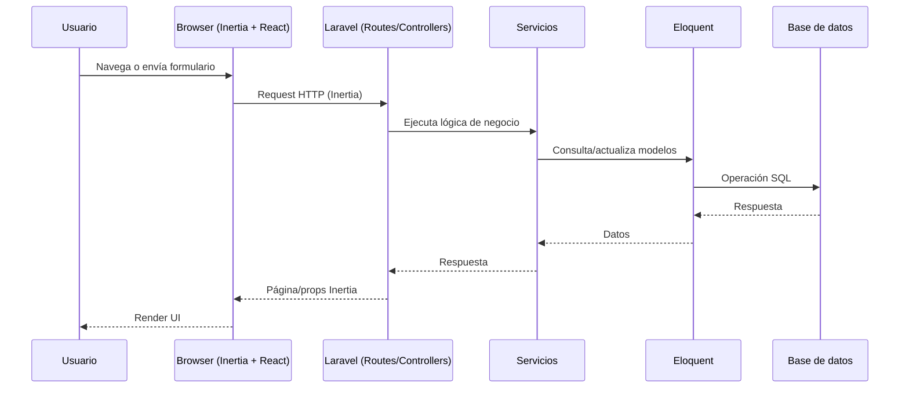

# Documentación técnica del proyecto

## 1. Resumen del proyecto
Este repositorio contiene una aplicación web basada en **Laravel 10** (backend) con **Inertia.js + React** (frontend) y un pipeline de assets gestionado por **Vite**. La UI combina **Material Dashboard**, **Bootstrap 5** y **MUI** para construir interfaces con componentes prearmados y estilos modernos. También incluye módulos de data tables, gráficos y selección de fechas. Para la capa de datos, se usa Eloquent ORM, migraciones y soporte para exportación/importación con Excel/CSV. Autenticación y autorización están soportadas mediante **Sanctum** y **spatie/laravel-permission**.

---

## 2. Arquitectura (alto nivel)

### 2.1 Capas principales
- **Backend (Laravel 10)**
  - Rutas HTTP y controladores.
  - Servicios y lógica de negocio.
  - Acceso a datos con Eloquent ORM.
  - Autenticación con Sanctum.
  - Autorización basada en roles/permisos (spatie/laravel-permission).
- **Frontend (Inertia.js + React)**
  - Vistas server-driven renderizadas en React.
  - Componentes UI con MUI y Bootstrap/Material Dashboard.
  - Manejo de formularios con React Hook Form.
- **Build & Assets**
  - Vite para compilación y bundling.
  - Tailwind CSS (utilizable junto a Bootstrap/MUI).

### 2.2 Diagrama de arquitectura

---

## 3. Flujo de petición (request lifecycle)

---

## 4. Dependencias principales

### 4.1 Backend (Composer)
| Librería | Propósito | Versión | Comentarios |
|---|---|---|---|
| laravel/framework | Framework principal | ^10.10 | Núcleo MVC y herramientas. |
| laravel/sanctum | Auth por tokens/sesiones | ^3.3 | Autenticación API/SPA. |
| spatie/laravel-permission | Roles/permisos | ^6.3 | Control de acceso. |
| inertiajs/inertia-laravel | Inertia bridge | 2.0 | Conecta Laravel + React. |
| laravel-frontend-presets/material-dashboard | UI preset | ^2.0 | Plantilla Material Dashboard. |
| maatwebsite/excel | Import/Export Excel | ^3.1 | Procesamiento de archivos. |
| league/csv | CSV | 9.0 | Parsing/serialización CSV. |
| jenssegers/date | Fechas i18n | ^4.0 | Utilidades de fecha. |

### 4.2 Frontend (NPM)
| Librería | Propósito | Versión | Comentarios |
|---|---|---|---|
| react / react-dom | UI | ^19.1.1 | Framework de frontend. |
| @inertiajs/react | Inertia adapter | 2.0 | React + Inertia. |
| @mui/material | UI components | ^7.2.0 | Componentes Material. |
| bootstrap / react-bootstrap | UI | ^5.3.7 / ^2.10.10 | Componentes y estilos. |
| material-dashboard | UI kit | ^3.0.9 | Diseño Material Dashboard. |
| chart.js | Gráficas | ^4.4.1 | Visualización de datos. |
| datatables.net-* | Tablas | varias | DataTables con Bootstrap. |
| sweetalert2 | Alertas | ^11.6.13 | Notificaciones. |
| vite | Build | ^5.0.0 | Bundler y dev server. |
| tailwindcss | Utilidades CSS | ^4.1.18 | Clases utilitarias. |

---

## 5. Estructura de carpetas (referencia rápida)
- `app/` → Lógica de la aplicación (models, controllers, services).
- `routes/` → Definición de rutas web/API.
- `resources/` → Frontend (views, JS/React, CSS/SASS).
- `database/` → Migraciones, seeders y factories.
- `public/` → Assets compilados y archivos públicos.
- `config/` → Configuración del framework.

---

## 6. Build y ejecución (alto nivel)
- **Backend**: `php artisan serve` (o Sail/Docker si se configura).
- **Frontend**: `npm install` + `npm run dev` (Vite).

---

## 7. Consideraciones técnicas
- Inertia evita una API REST separada: las páginas se sirven desde Laravel con props JSON.
- Roles/permisos y autenticación habilitan control de acceso a nivel de rutas y vistas.
- La combinación de MUI + Bootstrap + Material Dashboard requiere un manejo cuidadoso de estilos para evitar conflictos de CSS.
- Vite gestiona hot-reload y bundling rápido de los assets.

