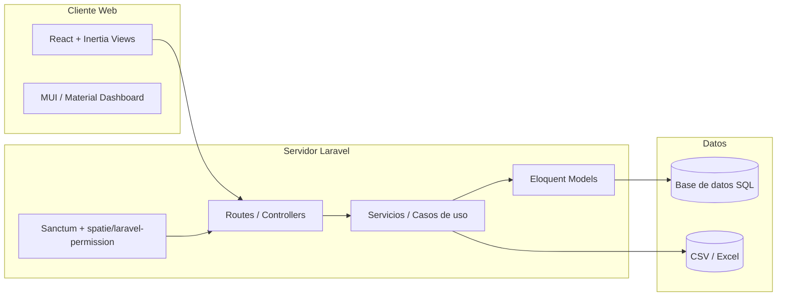
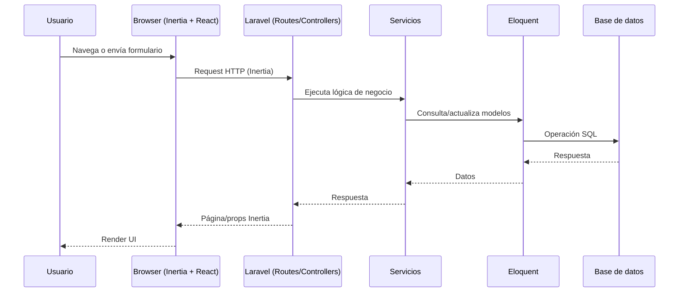

# Documentación técnica del proyecto

## 1. Resumen del proyecto
Este repositorio contiene una aplicación web basada en **Laravel 10** (backend) con **Inertia.js + React** (frontend) y un pipeline de assets gestionado por **Vite**. La UI combina **Material Dashboard**, **Bootstrap 5** y **MUI** para construir interfaces con componentes prearmados y estilos modernos. También incluye módulos de data tables, gráficos y selección de fechas. Para la capa de datos, se usa Eloquent ORM, migraciones y soporte para exportación/importación con Excel/CSV. Autenticación y autorización están soportadas mediante **Sanctum** y **spatie/laravel-permission**.

---

## 2. Arquitectura (alto nivel)

### 2.1 Capas principales
- **Backend (Laravel 10)**
  - Rutas HTTP y controladores.
  - Servicios y lógica de negocio.
  - Acceso a datos con Eloquent ORM.
  - Autenticación con Sanctum.
  - Autorización basada en roles/permisos (spatie/laravel-permission).
- **Frontend (Inertia.js + React)**
  - Vistas server-driven renderizadas en React.
  - Componentes UI con MUI y Bootstrap/Material Dashboard.
  - Manejo de formularios con React Hook Form.
- **Build & Assets**
  - Vite para compilación y bundling.
  - Tailwind CSS (utilizable junto a Bootstrap/MUI).

### 2.2 Diagrama de arquitectura


---

## 3. Flujo de petición (request lifecycle)


---

## 4. Dependencias principales

### 4.1 Backend (Composer)
| Librería | Propósito | Versión | Comentarios |
|---|---|---|---|
| laravel/framework | Framework principal | ^10.10 | Núcleo MVC y herramientas. |
| laravel/sanctum | Auth por tokens/sesiones | ^3.3 | Autenticación API/SPA. |
| spatie/laravel-permission | Roles/permisos | ^6.3 | Control de acceso. |
| inertiajs/inertia-laravel | Inertia bridge | 2.0 | Conecta Laravel + React. |
| laravel-frontend-presets/material-dashboard | UI preset | ^2.0 | Plantilla Material Dashboard. |
| maatwebsite/excel | Import/Export Excel | ^3.1 | Procesamiento de archivos. |
| league/csv | CSV | 9.0 | Parsing/serialización CSV. |
| jenssegers/date | Fechas i18n | ^4.0 | Utilidades de fecha. |

### 4.2 Frontend (NPM)
| Librería | Propósito | Versión | Comentarios |
|---|---|---|---|
| react / react-dom | UI | ^19.1.1 | Framework de frontend. |
| @inertiajs/react | Inertia adapter | 2.0 | React + Inertia. |
| @mui/material | UI components | ^7.2.0 | Componentes Material. |
| bootstrap / react-bootstrap | UI | ^5.3.7 / ^2.10.10 | Componentes y estilos. |
| material-dashboard | UI kit | ^3.0.9 | Diseño Material Dashboard. |
| chart.js | Gráficas | ^4.4.1 | Visualización de datos. |
| datatables.net-* | Tablas | varias | DataTables con Bootstrap. |
| sweetalert2 | Alertas | ^11.6.13 | Notificaciones. |
| vite | Build | ^5.0.0 | Bundler y dev server. |
| tailwindcss | Utilidades CSS | ^4.1.18 | Clases utilitarias. |

---

## 5. Estructura de carpetas (referencia rápida)
- `app/` → Lógica de la aplicación (models, controllers, services).
- `routes/` → Definición de rutas web/API.
- `resources/` → Frontend (views, JS/React, CSS/SASS).
- `database/` → Migraciones, seeders y factories.
- `public/` → Assets compilados y archivos públicos.
- `config/` → Configuración del framework.

---

## 6. Integración de vistas con controladores
La navegación se define en `routes/web.php`, donde cada ruta apunta a un controlador y método. Los controladores devuelven vistas Blade mediante `return view('...')`, y el nombre de la vista se resuelve en `resources/views/<ruta>.blade.php`.【F:routes/web.php†L46-L170】

### 6.1 Ejemplos clave de rutas → controladores → vistas
- `/home` → `HomeController@index` → `resources/views/home.blade.php`.【F:routes/web.php†L63-L67】【F:app/Http/Controllers/HomeController.php†L24-L28】
- `/dmtables` → `AdminController@index` → `resources/views/Table-inf.blade.php` (o `components/dmtables` en AJAX).【F:routes/web.php†L67-L69】【F:app/Http/Controllers/AdminController.php†L109-L122】
- `/egresos` → `EgresoController@index` → `resources/views/egresos/index.blade.php`.【F:routes/web.php†L162-L166】【F:app/Http/Controllers/EgresoController.php†L31-L50】
- `/validador-importacion` → `ValidadorImportacionController@index` → `resources/views/validador-importacion/index.blade.php`.【F:routes/web.php†L141-L152】【F:app/Http/Controllers/ValidadorImportacionController.php†L38-L52】
- `/puestos` → `PuestosController@index` → `resources/views/puestos.blade.php`.【F:routes/web.php†L103-L106】【F:app/Http/Controllers/PuestosController.php†L14-L62】
- `/perfiles` → `PerfilController@show` → `resources/views/perfiles.blade.php`.【F:routes/web.php†L93-L99】【F:app/Http/Controllers/PerfilController.php†L27-L33】
- `/empresas` → `EmpresasController@index` → `resources/views/empresas.blade.php`.【F:routes/web.php†L100-L103】【F:app/Http/Controllers/EmpresasController.php†L14-L41】
- `/departamentos` → `DepartamentosController@index` → `resources/views/departamentv.blade.php`.【F:routes/web.php†L106-L110】【F:app/Http/Controllers/DepartamentosController.php†L12-L49】
- `/infopersonal/{dni}` → `CandidatosController@GetIndividualInfo` → `resources/views/consultaficha.blade.php`.【F:routes/web.php†L71-L73】【F:app/Http/Controllers/CandidatosController.php†L660-L695】
- `/informes` → `InformesController@GetInformes` → `resources/views/informes.blade.php`.【F:routes/web.php†L70-L72】【F:app/Http/Controllers/InformesController.php†L14-L32】
- `/` (root) → vista directa `resources/views/home.blade.php` o `resources/views/auth/login.blade.php` según autenticación.【F:routes/web.php†L46-L61】

---

## 7. Controladores y métodos
### 7.1 AdminController
- `index(Request $request)`: lista candidatos/ingresos, usa stored procedure con fallback, aplica filtros/paginación y devuelve vista completa o parcial AJAX.

### 7.2 BloqueoController
- `__construct(CandidatosController $candidatoController)`: inyecta el controlador de candidatos para reutilizar parsing CSV.
- `actualizarOCrearFicha(array $candidatoData)` *(privado)*: valida datos, normaliza identidad/fecha, bloquea o crea candidato con estado `x`.
- `actualizacionMasivaBloqueos(array $data)` *(privado)*: procesa múltiples registros de bloqueo.
- `recibirBloqueos(Request $request)`: procesa CSV y aplica bloqueos en lote.

### 7.3 CandidatosController
- `compareFields($importedFields, $getTable)`: valida encabezados de CSV vs columnas de tabla.
- `processData(Request $re)`: parsea CSV manualmente y devuelve filas asociativas.
- `processData2(Request $re)`: parsea CSV usando `Excel::toArray` y normaliza datos.
- `validarCamposInsuficientes($datos, $columnHeaders)` *(privado)*: detecta filas con columnas faltantes.
- `formatUserDate($userDate)` *(privado)*: intenta normalizar fechas a `Y-m-d`.
- `validarFormatoFecha($datos)` *(privado)*: valida/normaliza fechas y reporta errores.
- `tieneBloqueoRecomendacion($identidad)` *(privado)*: revisa bloqueo de recomendación en ingresos.
- `crearOActualizarCandidato($candidatoData)` *(privado)*: crea o actualiza candidato según estado y bloqueo.
- `insertarCandidatosMasivos($datos)` *(privado)*: procesa candidatos en lote y retorna estados.
- `validarEstadoIngreso($identidad, $idEmpresaActual)` *(privado)*: determina estado de ingreso para una identidad.
- `crearOActualizarIngreso($ingresoData)` *(privado)*: crea un ingreso activo.
- `insertarIngresosMasivos($datos)` *(privado)*: inserta ingresos en lote y retorna estados.
- `importarIngresos(Request $request)`: importación masiva de ingresos con validaciones y transacción.
- `recibirCsvCandidatos(Request $request)`: importación masiva de candidatos desde CSV.
- `GetIndividualInfo($dni)`: obtiene ficha personal y laboral; retorna vista `consultaficha`.
- `Actualizacion_ficha(Request $re)`: actualiza datos de un candidato desde la ficha.
- `insertarCandidato(Request $request)`: registra candidato desde formulario.
- `recibirIngresos(Request $request)`: importación masiva “legacy” de ingresos con validaciones.
- `exportarEgresos(Request $request)`: exporta egresos a Excel.
- `importarEgresos(Request $request)`: importa egresos y ejecuta SP de actualización.
- `hacerIngreso(Request $request)`: crea ingreso manual y activa candidato.
- `hacerEgreso(Request $request)`: registra egreso y actualiza estados.
- `lockCandidate(Request $request)`: bloquea candidato y agrega comentarios.
- `unlockCandidate(Request $request)`: desbloquea candidato y agrega comentarios.
- `enviarSolicitudRecomendacion(Request $request)`: envía correo de solicitud de desbloqueo.
- `desbloquearRecomendacion(Request $request)`: actualiza recomendación a “sí”.

### 7.4 DashboardController
- `index()`: retorna la vista principal del dashboard.

### 7.5 DepartamentosController
- `index(Request $request)`: lista departamentos con filtros y paginación.
- `insertDepartament(Request $request)`: crea un departamento (empresa según rol).
- `insertDepartamentBulk(Request $request)`: importación masiva por filas/CSV.
- `show($id)`: consulta nombre de departamento.
- `updateDepartament(Request $request)`: actualiza un departamento.

### 7.6 EgresoController
- `__construct()`: aplica middleware `auth`.
- `index()`: carga vista de egresos y empresas permitidas.
- `listar(Request $request)`: lista empleados activos con filtros y paginación (JSON).
- `procesar(Request $request)`: procesa egresos en lote con validaciones.
- `catalogos(Request $request)`: obtiene catálogos de departamentos/puestos/áreas (JSON).
- `calcularAntiguedad(string $fechaIngreso)` *(privado)*: calcula antigüedad en texto.

### 7.7 EmpresasController
- `index(Request $request)`: lista empresas con filtros/paginación.
- `insertCompany(Request $request)`: crea empresa con logo.
- `insertCompanyBulk(Request $request)`: importación masiva por filas/CSV.
- `consultingCompany($request)`: devuelve datos de empresa por ID.
- `updateCompany(Request $request)`: actualiza datos de empresa.
- `updateCompanyState(Request $request)`: cambia estado activo/inactivo.

### 7.8 HomeController
- `__construct()`: aplica middleware `auth`.
- `index()`: carga vista `home` con perfil.
- `cargarDatosUsuario()`: devuelve datos de empresa/puestos/departamentos (JSON).

### 7.9 InformesController
- `GetInformes()`: calcula totales/promedios y retorna vista `informes`.
- `GetData()`: ingresos activos por empresa (JSON).
- `GetDataOut()`: egresos por empresa (JSON).
- `GetDataState()`: distribución por edad/estado/género (JSON).
- `IngresosxEgresos()`: serie temporal ingresos vs egresos (JSON).
- `RenunciasxGenero()`: renuncias por género (JSON).
- `GetLastSessionUser()`: usuarios con perfil/empresa (JSON).

### 7.10 LoginController (custom)
- `__construct()`: aplica middleware `guest` y actualización de sesión.
- `attemptLogin(Request $request)`: autenticación manual con `Auth`/`Hash`.

### 7.11 PerfilController
- `create(Request $request)`: crea perfil/rol.
- `show()`: lista perfiles y retorna vista.
- `update(Request $request)`: actualiza un campo del perfil (AJAX).

### 7.12 ProfileController
- `create()`: muestra formulario de perfil.
- `update()`: actualiza datos del usuario autenticado.

### 7.13 PuestosController
- `index(Request $request)`: lista puestos con filtros/paginación.
- `create(Request $request)`: crea un puesto (validaciones por empresa).
- `dataPuestos($id)`: devuelve datos de un puesto (JSON).
- `updatePosition(Request $request)`: actualiza un puesto.
- `puestosxEmpresas($idEmpresas)`: devuelve vista parcial con puestos.
- `insertPositionsBulk(Request $request)`: importación masiva por filas/CSV.

### 7.14 SessionsController
- `create()`: vista de inicio de sesión.
- `store()`: autentica credenciales y redirige.
- `show()`: envía enlace de reseteo de contraseña.
- `update()`: procesa reset de contraseña.
- `destroy()`: cierra sesión.

### 7.15 ValidadorImportacionController
- `__construct(...)`: inyecta servicios y aplica middleware `auth`.
- `index()`: muestra vista de validador.
- `validar(Request $request)`: valida CSV y devuelve errores/resultado.
- `revalidarRegistro(Request $request)`: revalida un registro individual.
- `confirmar(Request $request)`: confirma importación y procesa registros.
- `catalogos()`: devuelve catálogos según permisos (JSON).
- `descargarPlantilla(Request $request)`: genera plantilla de importación.

### 7.16 Controladores de Auth (Laravel)
- `Auth\\ConfirmPasswordController`: usa `ConfirmsPasswords`, protege confirmación de contraseña.
- `Auth\\ForgotPasswordController`: usa `SendsPasswordResetEmails` para enviar correos.
- `Auth\\LoginController`: usa `AuthenticatesUsers` para login estándar.
- `Auth\\RegisterController`: registra usuarios, valida datos, lista usuarios y actualiza estado/contraseña.
- `Auth\\ResetPasswordController`: usa `ResetsPasswords` para restablecer contraseña.
- `Auth\\VerificationController`: usa `VerifiesEmails` y aplica middlewares de verificación.

---

## 8. Guía de instalación (local)
1. Clonar el repositorio.
2. Instalar dependencias de PHP: `composer install`.
3. Instalar dependencias de frontend: `npm install`.
4. Copiar el archivo de entorno: `cp .env.example .env`.
5. Generar la clave de la app: `php artisan key:generate`.
6. Configurar la base de datos en `.env` (DB_HOST, DB_DATABASE, DB_USERNAME, DB_PASSWORD).
7. Ejecutar migraciones: `php artisan migrate`.
8. En desarrollo, levantar el frontend con Vite: `npm run dev`.

---

## 9. Creación del ambiente de desarrollo con XAMPP
1. Instalar XAMPP con PHP **8.1+** y MySQL.
2. Colocar el proyecto dentro de `htdocs` (por ejemplo `C:\\xampp\\htdocs\\ictgk_portal`).
3. Iniciar **Apache** y **MySQL** desde el panel de XAMPP.
4. Crear la base de datos desde phpMyAdmin.
5. Configurar `.env` con los valores locales (ejemplo típico):
   - `DB_HOST=127.0.0.1`
   - `DB_PORT=3306`
   - `DB_USERNAME=root`
   - `DB_PASSWORD=` (vacío, según configuración de XAMPP)
6. Ejecutar en terminal (usando el PHP de XAMPP):
   - `composer install`
   - `php artisan key:generate`
   - `php artisan migrate`
7. Levantar la app:
   - Opción A: `php artisan serve` y abrir `http://127.0.0.1:8000`.
   - Opción B: crear un VirtualHost apuntando a `public/`.
8. Para frontend en caliente: `npm run dev`.

---

## 10. Instalación en un servidor nuevo (producción)
1. Requisitos: PHP **8.1+**, Composer, Node.js/NPM, servidor web (Apache/Nginx) y base de datos.
2. Clonar o copiar el código en el servidor (por ejemplo `/var/www/ictgk_portal`).
3. Instalar dependencias de backend en modo producción:
   - `composer install --no-dev --optimize-autoloader`
4. Instalar dependencias de frontend y compilar:
   - `npm install`
   - `npm run build`
5. Configurar `.env` con credenciales reales y URL de la aplicación.
6. Ejecutar migraciones: `php artisan migrate --force`.
7. Generar el enlace de almacenamiento: `php artisan storage:link`.
8. Cachear configuración y rutas:
   - `php artisan config:cache`
   - `php artisan route:cache`
9. Dar permisos a `storage/` y `bootstrap/cache/` para el usuario del servidor web.
10. Apuntar el DocumentRoot del servidor a `public/`.

---

## 11. Migraciones (cómo se hacen y se ejecutan)
### 11.1 Crear una migración
```bash
php artisan make:migration create_nombre_tabla_table
```

### 11.2 Ejecutar migraciones
```bash
php artisan migrate
```

### 11.3 Revertir o refrescar
```bash
php artisan migrate:rollback
php artisan migrate:refresh
```

### 11.4 Ver estado de migraciones
```bash
php artisan migrate:status
```

---

## 12. Diccionario de campos (base de datos)
> Fuente: migraciones en `database/migrations/`.

### 12.1 Tabla `users`
- `id` (PK)
- `name`
- `email` (único)
- `email_verified_at` (nullable)
- `phone` (nullable)
- `location` (nullable)
- `about` (nullable)
- `password`
- `remember_token`
- `created_at`, `updated_at`

### 12.2 Tabla `password_reset_tokens`
- `email` (PK)
- `token`
- `created_at` (nullable)

### 12.3 Tabla `password_resets` (legacy)
- `email` (index)
- `token`
- `created_at` (nullable)

### 12.4 Tabla `failed_jobs`
- `id` (PK)
- `uuid` (único)
- `connection`
- `queue`
- `payload`
- `exception`
- `failed_at`

### 12.5 Tabla `personal_access_tokens`
- `id` (PK)
- `tokenable_type`, `tokenable_id` (morphs)
- `name`
- `token` (único)
- `abilities` (nullable)
- `last_used_at` (nullable)
- `expires_at` (nullable)
- `created_at`, `updated_at`

### 12.6 Tablas de permisos (Spatie)
Configuradas en `config/permission.php`:
- `roles`: `id`, `name`, `guard_name`, `created_at`, `updated_at`
- `permissions`: `id`, `name`, `guard_name`, `created_at`, `updated_at`
- `model_has_permissions`: `permission_id`, `model_type`, `model_id`
- `model_has_roles`: `role_id`, `model_type`, `model_id`
- `role_has_permissions`: `permission_id`, `role_id`
> Si `teams` se habilita en la configuración, se agrega `team_id` en tablas de pivote y `roles`.

### 12.7 Tabla `candidatos`
- `id` (PK)
- `identidad` (único)
- `nombre`
- `apellido`
- `telefono`
- `correo`
- `direccion`
- `generoM_F` (char 1)
- `fecha_nacimiento`
- `created_at`, `updated_at`

### 12.8 Tabla `egresos_ingresos`
- `id` (PK)
- `identidad`
- `id_empresa`
- `fechaIngreso`
- `area`
- `id_puesto`
- `activo` (char 1)
- `forma_egreso`
- `Comentario`
- `recomendado` (char 1)
- `recontrataria` (char 1)
- `prohibirIngreso` (char 1)
- `ComenProhibir`
- `created_at`, `updated_at`

### 12.9 Tabla `empresas`
- `id` (PK)
- `nombre`
- `direccion`
- `telefonos`
- `contacto`
- `pin`
- `puesto`
- `correo`
- `estado` (char 1)
- `logo`
- `created_at`, `updated_at`

### 12.10 Tabla `perfiles`
- `id` (PK)
- `perfilesdescrip`
- `ingreso` (tinyInteger)
- `egreso` (tinyInteger)
- `requisiciones` (tinyInteger)
- `calendarioentrevistas` (tinyInteger)
- `usuariosdb` (tinyInteger)
- `created_at`, `updated_at`

### 12.11 Tabla `departamentos`
- `id` (PK)
- `nombredepartamento`
- `empresa_id`
- `created_at`, `updated_at`

### 12.12 Tabla `puestos`
- `id` (PK)
- `nombrepuesto`
- `departamento_id`
- `created_at`, `updated_at`

### 12.13 Tabla `event_logs`
- `id` (PK)
- `user_id` (FK a `users`, nullable)
- `event_type`
- `event_data` (nullable)
- `created_at`, `updated_at`

---

## 13. Consideraciones técnicas
- Inertia evita una API REST separada: las páginas se sirven desde Laravel con props JSON.
- Roles/permisos y autenticación habilitan control de acceso a nivel de rutas y vistas.
- La combinación de MUI + Bootstrap + Material Dashboard requiere un manejo cuidadoso de estilos para evitar conflictos de CSS.
- Vite gestiona hot-reload y bundling rápido de los assets.
